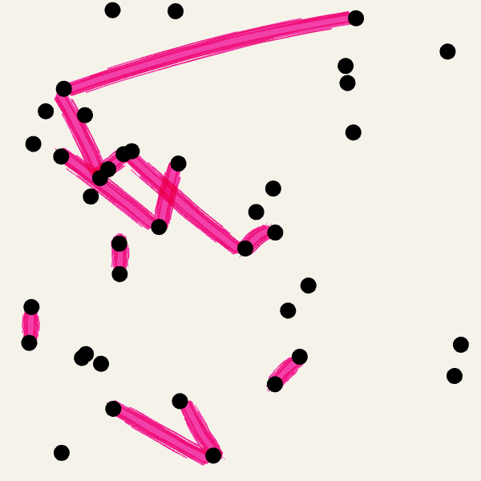

# sketchpad

A growing collection of generative art sketches made with [p5.js](https://p5js.org/) while learning creative coding.

Each sketch lives in its own folder and can be opened directly in the browser. Click the canvas to regenerate — every run is different.



## sketches

| sketch | description |
|--------|-------------|
| [connected dots](connected-dots/) | dots scattered across a canvas, connected by hand-drawn highlighter strokes |

## running locally

```bash
npx serve .
```
